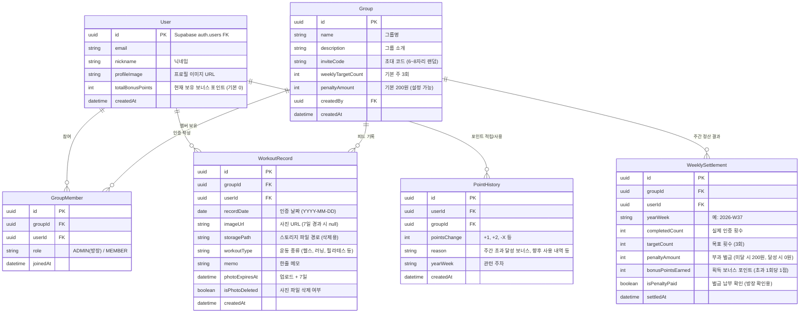
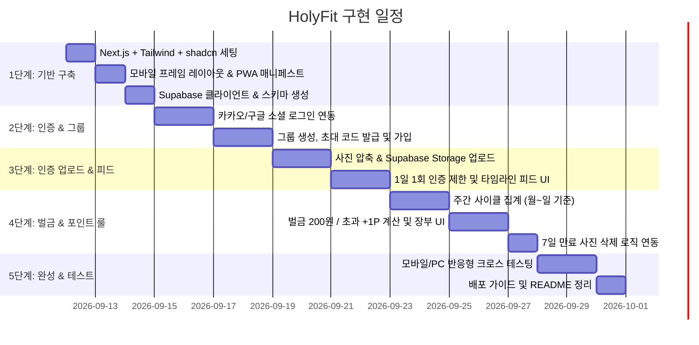

# [계획서 v2] 그룹 운동 인증 웹앱 (HolyFit) 개발 계획

PC, iPhone, Android 모든 디바이스에서 반응형 웹 및 홈 화면 추가(PWA)로 동작하는 **그룹 운동 인증 웹앱** 구축 계획입니다.  
사용자의 선택과 요구사항(Next.js + Supabase, 카카오/구글 소셜 로그인, 200원 벌금 및 초과 달성 시 회당 +1점 보너스 포인트 제도)을 반영하여 업데이트되었습니다.

---

## 1. 확정 요구사항 및 핵심 비즈니스 로직

1. **플랫폼 및 접근성**
   - **반응형 웹앱 (Mobile-first PWA)**: 모바일(iOS Safari, Android Chrome) 및 PC 브라우저 완벽 대응
   - **PWA 지원**: '홈 화면에 추가'를 통한 독립 앱 실행, 스플래시 화면, 카메라/갤러리 원활한 접근
2. **인증(Auth)**
   - **Supabase Auth 기반 카카오(Kakao) & 구글(Google) 소셜 로그인**
   - 로그인 후 첫 진입 시 운동 닉네임 및 프로필 설정/연동
3. **일일 사진 인증 (1일 1회)**
   - 매일 운동 사진 1장 업로드 (카메라 즉시 촬영 또는 갤러리 선택)
   - 클라이언트 측 이미지 자동 압축(WebP/JPEG, 트래픽 및 업로드 속도 최적화)
   - 운동 부위/종류 태그 + 한 줄 메모 입력
   - 하루 1회 인증 제한 (동일 일자 중복 방지)
4. **주간 룰 엔진 (벌금 200원 & 보너스 포인트 제도)**
   - **정산 주기**: 매주 월요일 00:00 ~ 일요일 23:59 (주간 7일 사이클)
   - **기본 목표**: 주 3회 인증 (그룹 설정에서 조정 가능, 기본값 3회)
   - **벌금 룰**: 주 3회 미달성 시 **벌금 200원** 부과 (그룹별 벌금 금액 커스텀 가능)
   - **보너스 포인트 룰**: 주 3회 초과 달성 시 **초과 1회당 +1점 보너스 포인트 적립**
     - 주 0~2회: 미달 (벌금 200원 부과, 보너스 0점)
     - 주 3회: 목표 달성 (벌금 0원, 보너스 0점)
     - 주 4회: 목표 +1회 초과 (+1 보너스 포인트)
     - 주 5회: 목표 +2회 초과 (+2 보너스 포인트)
     - 주 6회: 목표 +3회 초과 (+3 보너스 포인트)
     - 주 7회 (올출석): 목표 +4회 초과 (+4 보너스 포인트)
     - *향후 벌금 차감권, 칭호 부여, 리워드 교환 등 소비 기능으로 확장할 수 있도록 유저 잔여 포인트 및 적립 이력 테이블을 설계*
5. **사진 7일 보관 후 자동 삭제 (스토리지 정책)**
   - 업로드된 사진은 정확히 **7일 동안만 보관** 후 스토리지에서 자동 삭제
   - 사진 파일이 삭제되어도 "인증 일자, 시각, 운동 내용, 주간 달성 통계" 등 텍스트 데이터는 영구 보존
   - 7일 경과된 피드의 사진은 "사진 보관 기간(7일) 만료" 안내 카드로 깔끔하게 대체 표시

---

## 2. 확정 기술 스택 (Tech Stack)

```
[Client / Frontend]
Next.js 15 (App Router, React 19, TypeScript)
+ Tailwind CSS + shadcn/ui + Lucide Icons
+ Serwist / Next-PWA (PWA Service Worker & Manifest)

            │  (REST / Supabase Client SDK)
            ▼

[Backend as a Service (Supabase)]
├─ Auth: Kakao OAuth & Google OAuth
├─ Database: PostgreSQL (RLS 보안 정책 적용)
├─ Storage: Supabase Storage (`workout-photos` 버킷)
└─ Automation: pg_cron / Edge Functions (주간 정산 & 7일 사진 삭제)
```

| 영역 | 기술 스택 | 설명 |
| :--- | :--- | :--- |
| **프론트엔드 프레임워크** | **Next.js 15 (App Router)** | 모바일 화면 최적화, 빠른 반응 속도, 간결한 라우팅 |
| **스타일링 & UI** | **Tailwind CSS + shadcn/ui** | 앱 스타일 하단 네비게이션(Tab Bar), 바텀시트, 카드 UI 등 |
| **PWA** | **Serwist** | 오프라인 캐싱, 홈 화면 설치 프롬프트, 웹 푸시 지원 준비 |
| **BaaS / 백엔드** | **Supabase** | Auth, Postgres DB, Storage를 올인원으로 처리 |
| **소셜 로그인** | **Kakao & Google OAuth** | Supabase Auth Provider 연동 |
| **이미지 압축** | **browser-image-compression** | 브라우저에서 2MB 이하 WebP로 변환 후 업로드 |
| **배포 인프라** | **Vercel** | Next.js 최적화 배포 플랫폼 |

---

## 3. 데이터베이스 스키마 설계 (Supabase PostgreSQL)



---

## 4. 상세 기능 명세 및 사용자 흐름 (UX Flow)

### 1) 온보딩 및 소셜 로그인
- 모바일 첫 접속 시 감각적인 스플래시 & 온보딩 화면
- **[카카오로 시작하기]** 및 **[구글로 시작하기]** 버튼 제공
- 최초 가입 시 닉네임 설정 및 프로필 이미지 선택 후 메인으로 이동
- 이미 참여 중인 그룹이 없으면: **[새 그룹 만들기]** 또는 **[초대 코드로 그룹 들어가기]** 화면 안내

### 2) 메인 홈 화면 (모바일 뷰포트 중심 UI)
- **상단 헤더**: 그룹명 드롭다운 (다중 그룹 전환 가능), 나의 현재 보유 포인트 배지 (`⭐ 5P`)
- **이번 주 나의 상태 카드**:
  - `이번 주 인증: 2 / 3회` (프로그레스 바)
  - `목표까지 1회 남았어요! (벌금 200원 세이프까지 1일)`
  - 3회 달성 시: `축하합니다! 주간 목표 달성 완료! 🎉 (추가 운동 시 1회당 +1P 적립)`
  - 4회 이상 시: `보너스 포인트 +2P 획득 중! 🔥`
- **오늘의 운동 인증 액션 버튼**:
  - 오늘 아직 안 했으면: 눈에 띄는 큰 플로팅/고정 버튼 `[오늘 운동 인증하기 📸]`
  - 오늘 이미 완료했으면: `[오늘 인증 완료! 수고하셨습니다 👏]` 상태로 전환
- **그룹 실시간 피드 (Timeline)**:
  - 오늘 날짜에 그룹원들이 올린 인증 사진 카드 (인증 시간, 운동 종류, 메모)
  - 7일 지난 과거 사진은 *"보관 기간(7일)이 만료된 사진입니다"* 안내 플레이스홀더 표시

### 3) 운동 사진 인증 모달
- 사진 선택 (카메라 촬영 / 앨범 업로드)
- 이미지 즉시 미리보기 및 `browser-image-compression`으로 2MB 이하 WebP 압축
- 운동 종류 태그 칩 (헬스, 러닝, 수영, 필라테스, 홈트, 등산, 기타)
- 간단 소감 입력 (선택)
- [인증 제출] 클릭 시 Supabase Storage 및 DB에 저장 후 피드 즉시 갱신

### 4) 주간 정산 및 벌금 & 포인트 대시보드
- **탭 구분**: [이번 주 현황] | [지난 주 정산 리포트] | [포인트 장부]
- **이번 주 현황**:
  - 그룹 멤버별 실시간 주간 달성 횟수 (0회~7회)
  - 안전권(3회 이상) / 위험권(0~2회) 시각화
- **지난 주 정산 결과**:
  - 미달자: 벌금 명단 (각 200원씩) 및 총 벌금 누적액
  - 초과 달성자: 보너스 포인트 수령자 명단 (예: 철수 +2P, 영희 +4P)
  - 방장이 벌금 수납 여부를 토글(`납부 완료`) 체크할 수 있는 간이 장부 제공
- **내 포인트 내역**:
  - 총 보유 보너스 포인트 및 주차별 적립 이력 조회

### 5) 7일 사진 만료 처리 로직
- **자동 정리 메커니즘**:
  - DB의 `photo_expires_at` 컬럼에 `created_at + INTERVAL '7 days'` 저장
  - Supabase Edge Function 또는 Cron 작업을 통해 `photo_expires_at < NOW()` 대상의 스토리지 파일 삭제 및 DB `is_photo_deleted = true`, `image_url = null` 업데이트
  - 클라이언트 피드에서는 `is_photo_deleted = true`인 경우 만료 안내 카드 표시

---

## 5. 단계별 구현 로드맵



### 단계별 세부 작업

#### Step 1: 프로젝트 기초 환경 구축
- Next.js 15 App Router + TypeScript 프로젝트 생성
- Tailwind CSS 및 모바일 앱 뷰 컨테이너 (최대 너비 430px 모바일 화면 모드 + 데스크톱 뷰 대응)
- Serwist PWA 설정 (`manifest.json`, 앱 아이콘, 테마 컬러)
- Supabase 프로젝트 환경변수 템플릿(`.env.example`) 및 DB 마이그레이션 SQL 스크립트 작성

#### Step 2: 카카오/구글 로그인 & 그룹 관리
- Supabase Auth를 통한 카카오/구글 소셜 로그인 플로우 구성 (Mock/로컬 테스트 모드 병행)
- 그룹 생성 모달 (그룹명, 목표 횟수 기본 3회, 벌금 기본 200원)
- 초대 코드 생성 및 초대 코드로 입장 기능

#### Step 3: 사진 인증 파이프라인 & 그룹 피드
- 이미지 파일 선택 시 `browser-image-compression`으로 압축 후 Supabase Storage 업로드
- WorkoutRecord 레코드 생성 및 하루 1회 중복 방지 검증
- 홈 피드에 실시간 인증 타임라인 렌더링

#### Step 4: 주 3회 정산 룰 & 보너스 포인트 시스템
- 주차(ISO Week, 월~일) 기준 인증 횟수 계산 쿼리/함수 구현
- 주 3회 미달자: 200원 벌금 부과 내역 생성
- 주 3회 초과자: 초과 1회당 +1 보너스 포인트 누적 및 PointHistory 적립
- 주간 정산 대시보드(벌금 장부, 랭킹, 포인트 잔액) UI 구현
- 7일 경과 사진 자동 삭제 로직(스토리지 파일 정리 및 UI 만료 처리)

#### Step 5: PWA 최적화 및 최종 검증
- iOS Safari '홈 화면에 추가' 안내 가이드 팝업
- Android Chrome PWA 설치 프롬프트
- PC 브라우저와 모바일 화면 간의 유려한 반응형 레이아웃 확인

---

## 6. 검증 계획 (Verification Plan)

### 1) 자동화 및 로직 검증
- **주간 정산 룰 단위 검증**:
  - 0회, 1회, 2회 달성 시 -> 벌금 200원, 보너스 0P 확인
  - 3회 달성 시 -> 벌금 0원, 보너스 0P 확인
  - 4회 달성 시 -> 벌금 0원, 보너스 +1P 확인
  - 7회 달성 시 -> 벌금 0원, 보너스 +4P 확인
- **1일 1회 인증 제한 검증**:
  - 당일 이미 업로드한 유저가 재업로드 시도시 알림 및 방지 확인

### 2) 모바일/웹 UI & PWA 검증
- Chrome DevTools 디바이스 에뮬레이터(iPhone 15, Galaxy S24)에서 하단 네비게이션바, 상단 헤더, 모달 터치 UX 테스트
- PWA `manifest.json` 유효성 및 오프라인 서비스 워커 로딩 점검

### 3) 7일 사진 만료 정책 검증
- 업로드된 지 7일이 지난 임의 데이터를 생성하여 피드 조회 시 정상적으로 "보관 기간 만료" 안내로 렌더링되는지 확인
